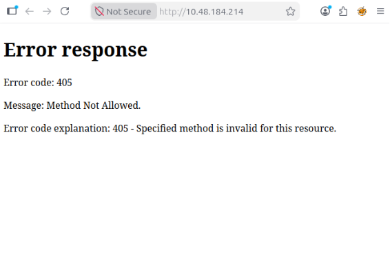
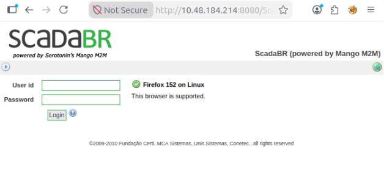
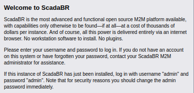
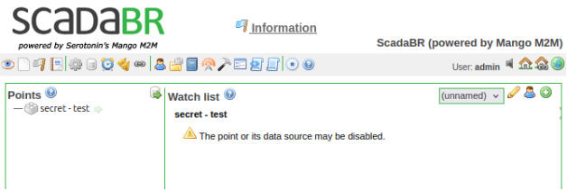
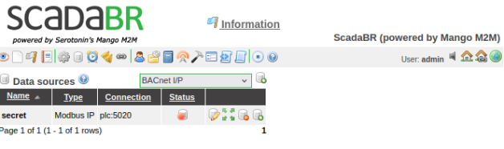
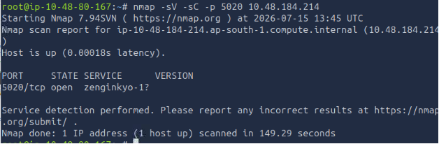
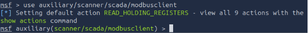
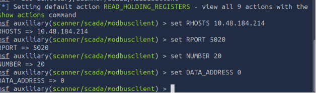
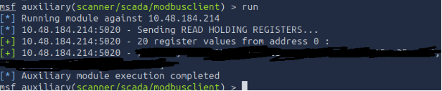

**BRR**

Итак, это пошаговое решение этой комнаты для совсем начинающих хацкеров.

**NMAP**\
Начнём с самой бызы. Как только запускается машина, сразу же включаем nmap со всеми нужными флагами и ждём , что это чудо нам выдаст. Паралельно можно также открыть браузер и самому вписать туда ip машины , авось повезёт.\
При введении ip в поисковик мне выдало вот это:\


Вобщем то, ничего нужного, но к этому времени закончил работу nmap, и вот что он мне выдал:

Ага, значит ещё есть что-то на порте 8080 (да, конечно это можно назвать обычным портом но мы тут пишем для самых маленьких, так что объясняю и это)

После входа на порт 8080, нас сразу же кидает на вот этот поддомен:\


(Если вас по какой-либо причине не перекинуло, то вот путь: "http://\*\*\*\*\*\*\*\*\*\*\*\*/ScadaBR/login.htm")

Тут я немного встрял, так как сначала попробовал SQLI, потом думал начать брутфорсить, но вовремя нажал на синюю кнопачку около кнопки логин:\


Короче "admin" "admin" подошло, ну и ладно.

При заходе не сайт мы сразу же видим блок secret-test, ну и так как у нас iq минимум двузначное, понимаем, что попасть нужно именно туда.



Немного полазив по сайту (что я в целом советую), вы можете наткнуться на Data sources: 

` ` 

тут сразу можно увидеть что наш secret можно развернуть на порту 5020 нажав на status.Вот так:\


После этого нужно как-то зайди на него, можно опять проверить всё через nmap:\


Тут мы видим TCP, видим что он открыт и видим специфический сервис zenginkyo-1?

**Meta**

На этом моменте можно вспомнить, что такое метасплоит и пойти проверить скаду через него:\
Запускаем msf:

```msfconsole```

После чего выбираем модуль для чтения регистров:


```use auxiliary/scanner/scada/modbusclient```


\
Далее настраиваем мету:
```
set NUMBER 20\
set DATA\_ADDRESS 0\
set RPORT 5020
set RHOSTS 10.48.166.252
```

\
Ну и запускаем командой run:\
\
Мы получаем много непонятных цыфры. Однако после расшифровки через ASCII Мы получаем наш флаг!\
\
Спасибо за то, что причитали мой первый разбор задания. Я только учусь писать подобное, так что не судите строго))
